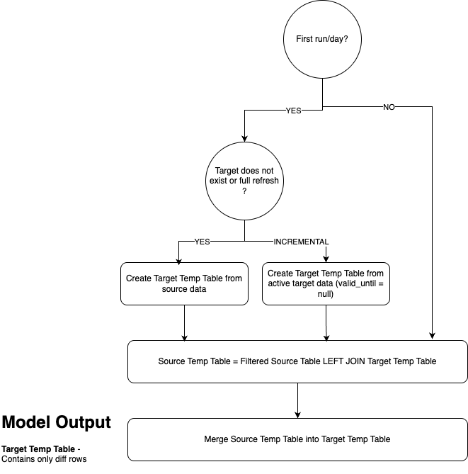

This document explains how we use custom script to build snapshot for dimension tables.

Quick links:
- [What is a Snapshot](#what-is-a-snapshot)
- [How snapshot feature works in DBT?](#how-snapshot-feature-works-in-dbt)
   - [Limitations of DBT Snapshot](#what-are-the-limitations-of-dbt-snapshot)
- [What is our approach](#what-is-our-approach)
   - [Control Flow Diagram](#control-flow-diagram)
   - [Custom Materialization](#incremental-snapshot-materialization)
- Usage
   - [How to build snapshot models using macros?](#how-to-build-snapshot-using-custom-snapshot-macros)
   - [Data repairs](#data-repairs)
   - [Airflow Orchestration](#airflow-orchestration)
   - [Limitations](#limitations)
   - [Performance Benchmarking](#performance-benchmarking)
   - [How to use Snapshots table](#how-to-use-snapshot-tables)

## What is a Snapshot?

A Snaphot is an altered version of a source dataset which allows to track history of an entity over the time. Let's take an example:
Source dataset tracks balance of a given user. The balance can change over the time as various kind of transactions are made to/from the user's account.

Source data schema can look as following:

| Column Name | Data type |
| -- | -- |
| user_id | string |
| created_at | timestamp |
| balance | float |
| extra_col | str |

Whenever balance changes for a user, above table will have a new record inserted. The above table is good to keep historical data around, however when someone wants to know point in time balance for a given user or latest balance for each user, it becomes computationally expensive, as you would have to scan entire table data, create a lineage and then find the latest balance.

To make this data readily available for an analyst, there exists concept called snapshot. Snapshots can be thought of as cron jobs which takes "snapshot" of the table at a given cadence and tracks changes over time.

Snapshot schema for a given source data will look as following:

| Column Name | Data type |
| -- | -- |
| user_id | string |
| created_at | timestamp |
| balance | float |
| extra_col | str |
| valid_from | timestamp |
| valid_to | timestamp |

Notice that `valid_from` and `valid_to` essentially depicts time brack until a given record for a user is valid. If balance is active currently, `valid_to` is set as `null` or empty generally.

_The above schema is also refer to SCD Type-2 table_

## How snapshot feature works in DBT?

DBT provides an out-of-the-box feature to create snapshot. It compares the snapshot table and the source table for a given account_id and if anything changes since when the last snapshot was created, it will add those records. Essentially three things happen:
- Insert new source records as is.
- Insert updated version(from source) of an existing record.
- Update existing version(target). The `valid_to` is reset to `valid_from` of next state of the record.

## What are the limitations of DBT Snapshot?

DBT Snapshots are great as long as everything runs successfully. However, the moment any job fails, or we find a data hole, or we find an incorrect data in snapshot table, life becomes tough.

This is because:
- There is no way to replay snapshots as DBT snapshot is only front-filling. The best solution in that case is to stay away from the nitty gritties of spot fixing, drop the table and start front-filling. However, you lose all the history.
- DBT snapshots are a black box. If ever, any logic changes on DBT's end or we configure it incorrectly, we have very little means to fix it historically.

All in all repairing snapshot / SCD type-2 table sucks!!!

## What is our approach?

We built a custom macro to build snapshots. We materialize snapshot essentially as an incremental model with capability of backfilling/repairing historical data.

### Input and Output

**Input:**
- Source Table: Table for which we want to create snapshot. Example: accounts
- Target Table: Table which contains existing snapshot data. For the initial run/full refresh, this will considered empty. This is an input since source table is compared against target to find diff.

**Temporary Tables:**
- Filtered Source Table: This contains a day worth of source data which needs to be compared.
- Filtered Target Table: This contains latest state of records from snapshot table i.e. records with `valid_to= None`.
- Source Temp Table: This contains diff of records which need to be insert into target table. Recall three set of data mentioned above - new, updated target, updated source. This contains only 1 day worth of data. The schema is same as target table.
- Target Temp Table: This is essentially same as Source Temp Table, however it contains "final" set of changes to be applied to Target Table. For example, for a backfill of a month, source temp table will only contains 1 day worth of data (scoped to the loop run), however Target Temp Table contains all day worth of data.

**Output:**
- Target Table: The data in Target Temp Table is essentially full diff which needs to be applied. The model reads from Target Temp Table and applied to Target Table.

### Control Flow Diagram



### Incremental Snapshot materialization

Tables, Views, Incremental, etc are some of the out-of-the-box materialiations provided by DBT. A [custom materialization](https://docs.getdbt.com/guides/create-new-materializations?step=1) is designed to solve the problem of backfilling historical snapshots efficiently.
This materialization is essentially an overloading for incremental materialization provided by DBT.


```sql

  {% set presql =
      backfill_snapshot(
              config.get('source_name'),
              this,
              this.project ~ '.' ~ this.schema ~ '.' ~ config.get('temp_source_table'),
              this.project ~ '.' ~ this.schema ~ '.' ~ config.get('temp_target_table'),
              config.get('snapshot_start_date'),
              config.get('snapshot_end_date'),
              config.get('updated_at_col_name'),
              config.get('dbt_valid_from_col_name'),
              config.get('dbt_valid_to_col_name'),
              config.get('source_unique_key')
          )
  %}
.
.
.

{{ presql }}
{{ bq_create_table_as(partition_by, False, target_relation, compiled_code, language) }}

.

```

#### Why did we not use Incremental materialization as is?

Incremental materialization allows only a single statement to be executed as part of DBT model. The single statement should be able to calculate diff to be applied to target table.

This works perfect if we were to support running only 1 day worth of backfill at a time. However, our approach makes the process efficient by not requiring to kick off 365 airflow tasks to backfill whole year. Rather, it could be done in 1 airflow task or at max 4 (1 for each quarter) airflow tasks.

In a single airflow task, we can essentially create multiple statements:

```
-- DAY 1
CREATE ....;
UPDATE ....;
MERGE INTO ... target_temp_table;
-- DAY 2
CREATE ....;
UPDATE ....;
MERGE INTO ... target_temp_table;
.
.
.
```

So how custom materialization works is that it pre-executes all of the above statements to calculate the diff. All that the actual model needs to do is read from `target_temp_table`. This contains the final diff for entire backfill duration requested.

**Important Note:**: DBT incremental materialization supports pre-hook and post-hook config where you can execute a group of statement before actually running the model. However, jinja variables do not populate as expected in prehool/sql header and this is a [known issue/limitation](https://github.com/dbt-labs/docs.getdbt.com/issues/4890) in DBT.

### How to build snapshot using custom Snapshot Macros?

Generally, a user can specificy model as following, which will work for any model.

```
-- depends_on: {{ ref('stg_claimable_balances') }}



{% set meta_config = {
    "materialized": "incremental_snapshot",
    "unique_key": ["balance_id", "valid_from"],
    "partition_by": {
         "field": "valid_to"
        , "data_type": "timestamp"
        , "granularity": "month"
    },
    "cluster_by": ["balance_id"],
    "source_name": 'stg_claimable_balances',
    "temp_source_table": temp_source_table,
    "temp_target_table": temp_target_table,
    "snapshot_start_date": var("snapshot_start_date"),
    "snapshot_end_date": var("snapshot_end_date"),
    "full_refresh": var("snapshot_full_refresh") == 'true',
    "updated_at_col_name": 'closed_at',
    "valid_from_col_name": 'valid_from',
    "valid_to_col_name": 'valid_to',
    "source_unique_key": 'balance_id',
    "tags": ["custom_snapshot_claimable_balances"]
} %}

{{ config(
    meta=meta_config,
    **meta_config,
    )
}}

SELECT * from {{ this.project ~ '.' ~ this.schema ~ '.' ~  temp_target_table }}
```

However, if a user is not interested in backfill option, they can call `create_snapshot` macro directly and use incremental materialization.

### Data Repairs:

Depending on the severity of the option, we can repair only the hole or we can fully refresh a table.

For repairing a hole, kick off Airflow DAG manually with appropriate `snapshot_start_date` and `snapshot_end_date`. A re-run should run normally as it creates deterministic output.


### Airflow orchestration:

- A single [DAG](https://github.com/stellar/stellar-etl-airflow/blob/patch/add-snapshot-dag/dags/dag_snapshot.py) in airflow which runs at 01:00 UTC everyday.
- DAG consist of multiple tasks - `task_trustline_snapshot`, `task_liquidity_pool_snapshot`, etc
- snapshot_start_date and snapshot_end_date is provided by airflow i.e. 1 day for incremental run
- Ability to kick off job manually with custom snapshot_start_date and snapshot_end_date.


### Limitations
- To not lose any history, it is expected that backfill runs sequentially.
- If a day worth of backfill is missed by any chance and is attempted to be repaired later, there is slight chance of missing history. This happens when a new version of record is already present.
- It is expected from user that they do not run parallel snapshot jobs for same table, as it can cause unexpected output.

But nonetheless, full-refresh will help to gain back full snapshot history anytime. \o/


### How to use Snapshot tables

```
-- Check user's balance on March 30, 2024
SELECT * FROM `project-id`.`schema`.`trustlines_snapshot`
WHERE
date(valid_from) <= '2024-03-30'  and
    (
        date(valid_to) is null or
        date(valid_to) > '2024-03-30'
    )
```
